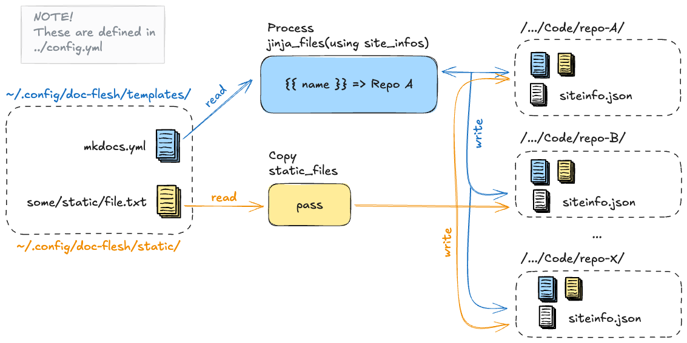

# doc-flesh

Ah, some flesh for [doc-skeleton](https://github.com/sourander/doc-skeleton) template's bones! This tool allows hosting canonical config files in HOME directory and syncing those to ALL repositories based on doc-skeleton locally.



**Diagram 1:** *The flow from `~/.config/.../` to X different repository directories explained as a diagram. The files are then committed and pushed to origin main.*

In the original creator's context, the affected repositories are listed at [sourander.github.io](https://sourander.github.io/) site. All these repositories share the same template Github project, called doc-skeleton. Syncing the changes could be done using Git submodules or clever forking and merges, but I chose to use this tool for syncing the config files. The tool allows the repositories to be more independent. Also, this allows clever tricks like running `uv lock --upgrade` in each repository to upgrade the dependencies in all repositories at once.

## Configuration

The configuration file is a YAML file located at `~/.config/doc-flesh/config.yaml`. The file should contain a list of repositories to be managed. Each repository should have an absolute `local_path` and a `name` key. The `local_path` should point to the local repository's root directory. The `name` key is used for logging purposes.

```yaml
Files: &defaults
  jinja_files:
    - mkdocs.yml
  static_files:
    - .github/workflows/mkdocs-merge.yaml
    - docs/javascripts/mathjax.js

ManagedRepos:
  # A repository using only the default Files
  - local_path: /Users/me/Code/me/oat/
    name: Oppimispäiväkirja 101
    <<: *defaults

  # A repository using files that are not common to all repos
  - local_path: /Users/me/Code/me/repo-b/
    name: Repo B
    <<: *defaults
    jinja_files:
      - some/dynamic/config.yml
    static_files:
      - some/static/file/used/by/many/but/not/all.js
```

There are two sorts of files:

* **Jinja files**: The files are expected to have a key for each value in the `$REPO/siteinfo.json` file that is also used for updating the `sourander.github.io` site every night.
* **Static files**: These files are copied from the HOME directory to the repository as is.

## Installation and Usage

The tool is meant to be run locally using [uv](https://docs.astral.sh/uv/).

```bash
# Clone
git clone $url

# Run
uv run doc-flesh --help
```

### Commands

It is assumed that all commands below are prefixed with `uv run` as shown above.

#### Check

You can manually check the repositories for dirtiness using the `check` command. Note that the sync command also checks for dirtiness before proceeding for safety.

```bash
doc-flesh check
```

Before proceeding syncing ANY templates to ANY repository, the tool verifies that all repositories are in a non-dirty state.

**Currently Verified Non-Dirtyness:**

* ✅ Repository existence (path exists)
* ✅ Current branch is 'main'
* ✅ Repository is not bare
* ✅ Repository has no uncommitted changes (not dirty)
* ✅ Repository is not in detached HEAD state
* ✅ Local and remote branches point to the same commit (after fetching)
* ✅ Working copy is not in a rebase, merge, or cherry-pick state

**Assumed but Not Verified:**

* 🚧 Branch protection rules allow direct pushes to main
* 🚧 Repository has a properly configured remote named 'origin'
* 🚧 No hooks that might interfere with the commit or push operations
* ⁉️ And potentially some unknown unknowns


#### Sync

Running the sync runs the check command first and then proceeds to sync the files to the repositories.

```bash
doc-flesh sync [--dry-run]
```

The sync command does the following:

* Checks the repositories for dirtiness.
* Copies the Jinja files to the repositories (using variables from the `$REPO/siteinfo.json` file).
* Copies the static files to the repositories.
* Commits the changes to the repositories.
* Pushes the changes to the repositories.

The `--dry-run` flag can be used to show what would be done without actually doing it. It will instead write the files into a temporary directory for inspection. Example below.

```console
$ uv run doc-flesh sync --dry-run
🔍 Checking repo: /Users/janisou1/Code/sourander/oat
🔄 Fetching updates from remote...
✅ Repo is up-to-date with the remote.
✅ Repo is clean and safe for automation.
🔧 All files will be written to /private/var/folders/aa/hash/T/tmpe8u9pv9o under directories with the same name as each repository.
🔧 Dry-run: skipping the Git operations.
🎉 Sync complete.

$ ls /private/var/folders/aa/hash/T/tmpe8u9pv9o
/private/var/folders/6q/glcwrb855ss6mjvqhjzk4lbctxydll/T/tmpe8u9pv9o
└── Oppimispäiväkirja 101
    ├── docs
    │   └── javascripts
    │       └── mathjax.js
    └── mkdocs.yml

4 directories, 2 files
```

## Development notes

* Add a `--dry-run` flag to the `sync` command to show what would be done without actually doing it. 
    * The files could be written to `output/repoconfig.name/../../file.txt` for inspection.
    * This is trickier with GitPython. It does not really have a dry-run mode. Maybe simple print the Python statements that would be executed?
* I need to make sure this works with both HTTPS and GIT authentication. 

Obvious stuff:

* The tool is not yet fully functional. 
    * The `check` command is mostly done, but the `sync` command is still in the works.
